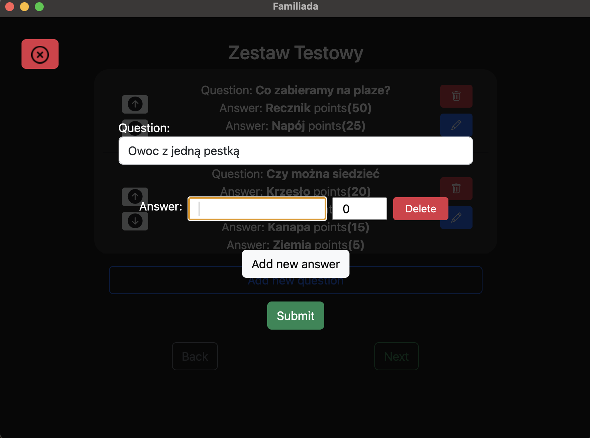
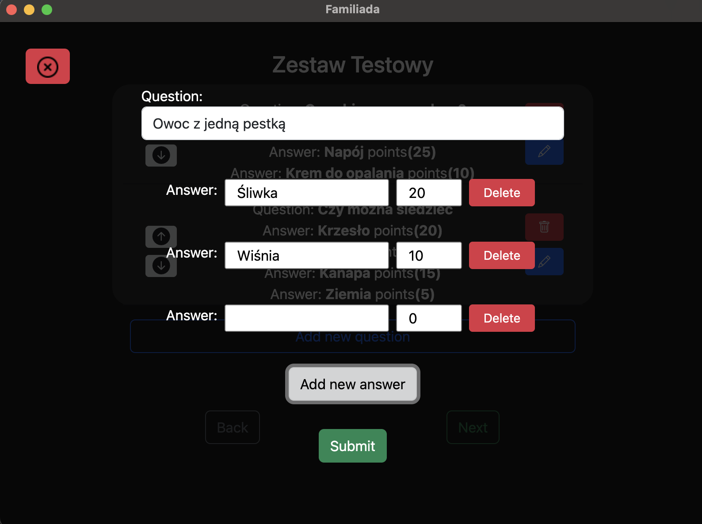
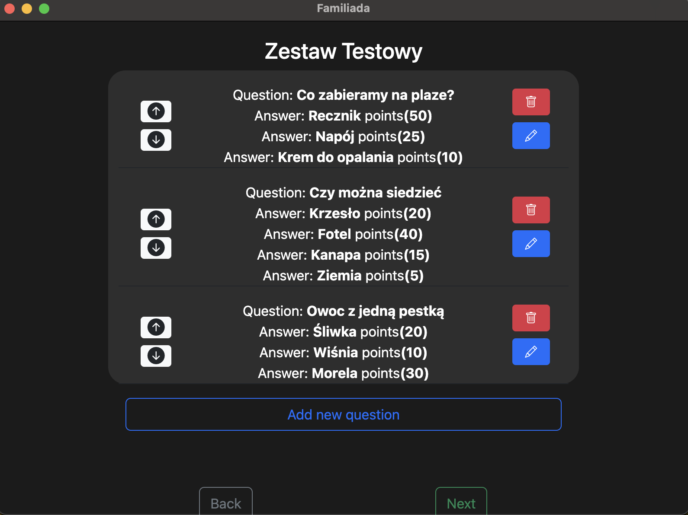
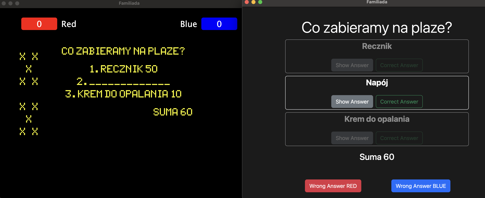
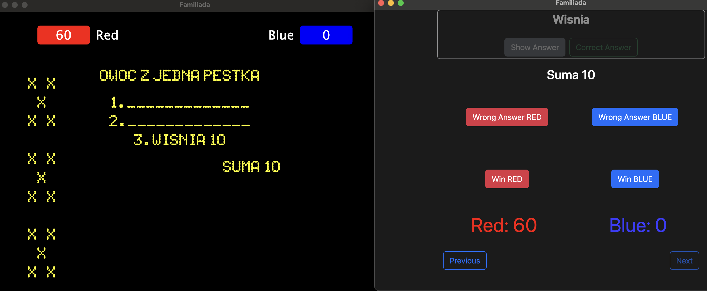

# Familiada

Familiada is a project created for Dj Dave who uses it in events as fan with guests. It is a Game in imitation of popular program "Familiada".

Presenter can create Collections, and in it can create Questions with answers and points. Before starting he can set sequence of questions. You can edit and delete all of contents, which is saved in locally database.

Once the game starts, one screen displays a window for the instructor to control the game (displaying answers, assigning points, etc.). The other window displays the scoreboard for the players.

## Installation

1.  Install **NPM** **Node.js**

2.  In folder _app_ install modules:

    ```bash
    npm install
    ```

3.  Start Server

    ```bash
    npm start
    ```

    - Dev

      ```bash
      npm run electron
      ```

    - Prod

      ```bash
      npm run make
      ```

      Launch App in folder out.

## Technologies

- Electron
- Sequelize
- SQLite
- React
- Bootstrap

## Preview






